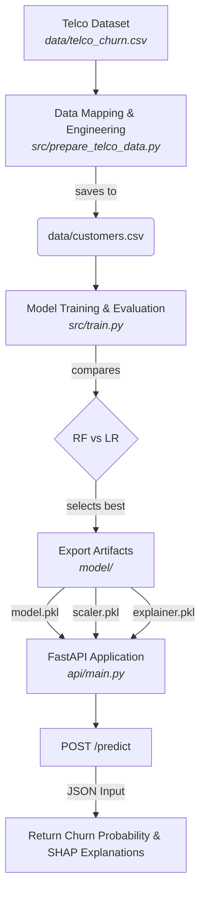

# Architecture Diagram

```mermaid
graph TD
    A[Telco Dataset<br><i>data/telco_churn.csv</i>] --> B[Data Mapping & Engineering<br><i>src/prepare_telco_data.py</i>]
    B -->|saves to| C(data/customers.csv)
    C --> D[Model Training & Evaluation<br><i>src/train.py</i>]
    D -->|compares| E{RF vs LR}
    E -->|selects best| F[Export Artifacts<br><i>model/</i>]
    F -->|model.pkl| G[FastAPI Application<br><i>api/main.py</i>]
    F -->|scaler.pkl| G
    F -->|explainer.pkl| G
    G --> H[POST /predict]
    H -->|JSON Input| I[Return Churn Probability & SHAP Explanations]
```
